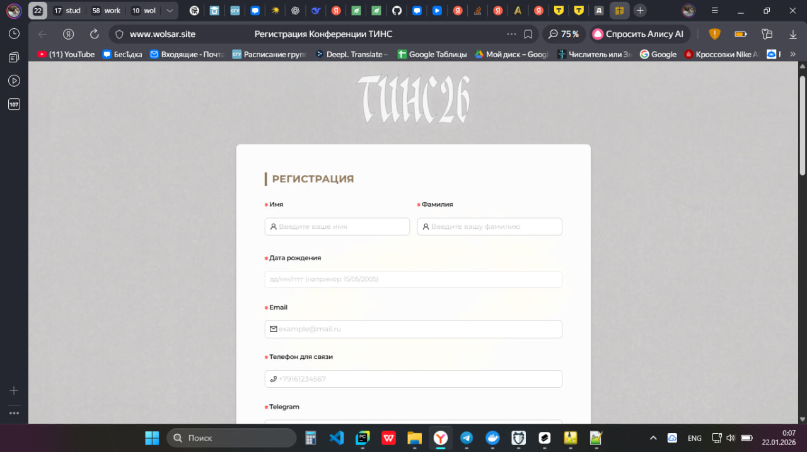
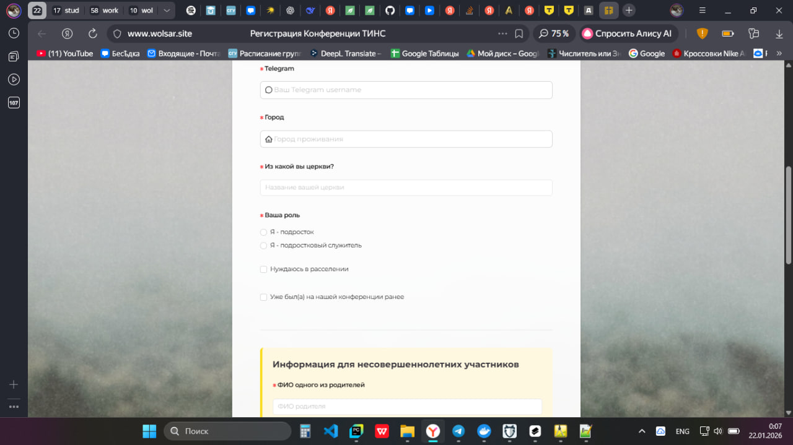
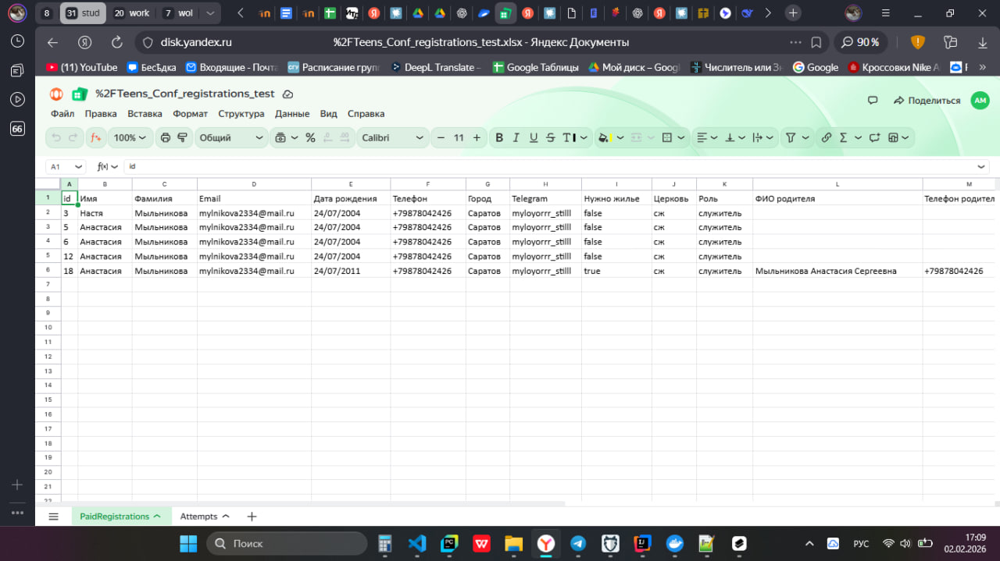
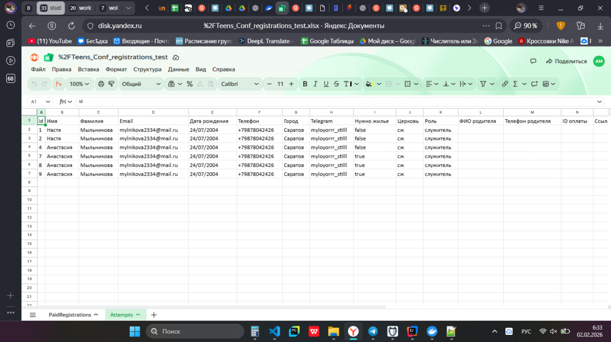
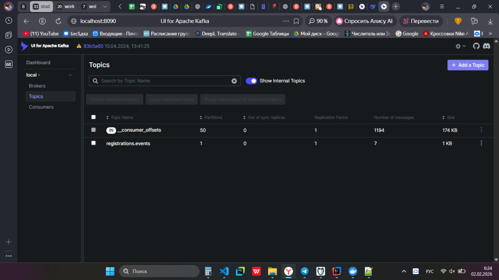
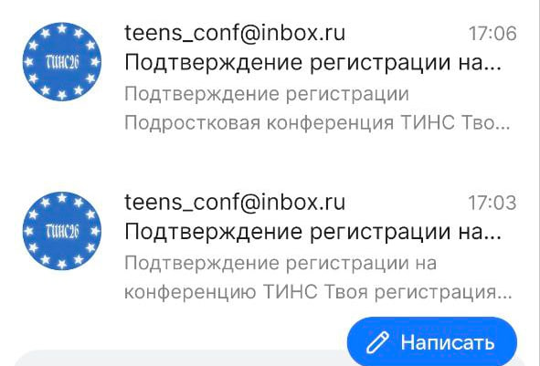
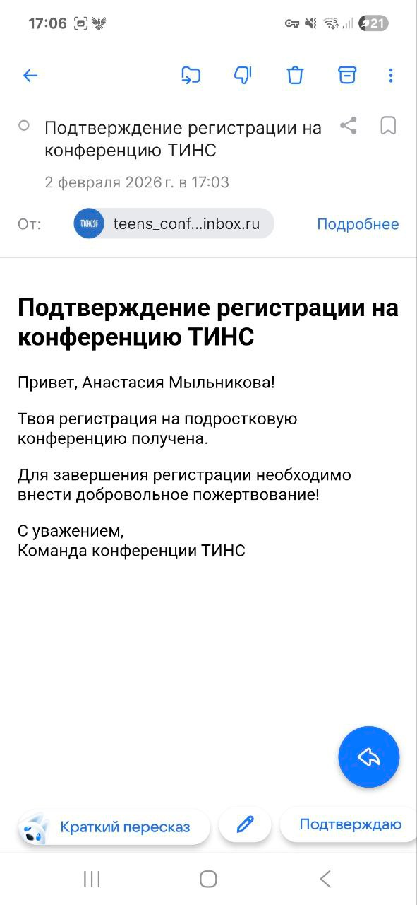
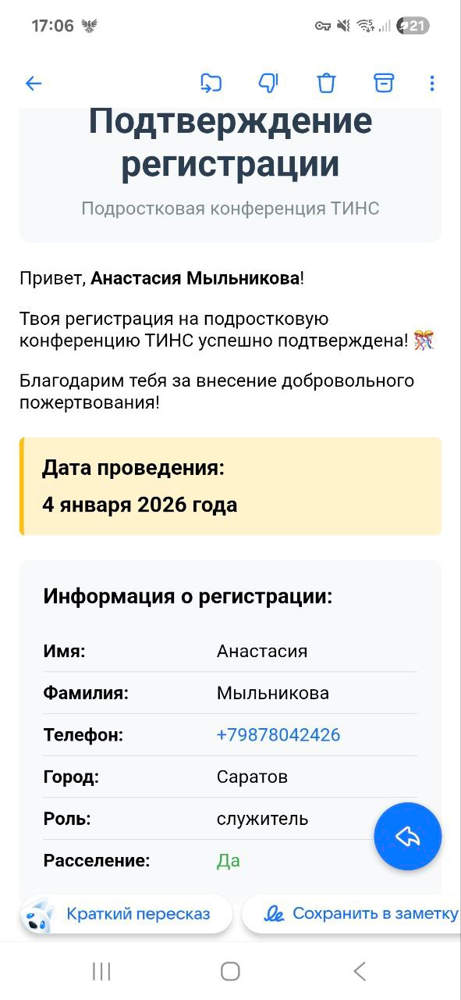
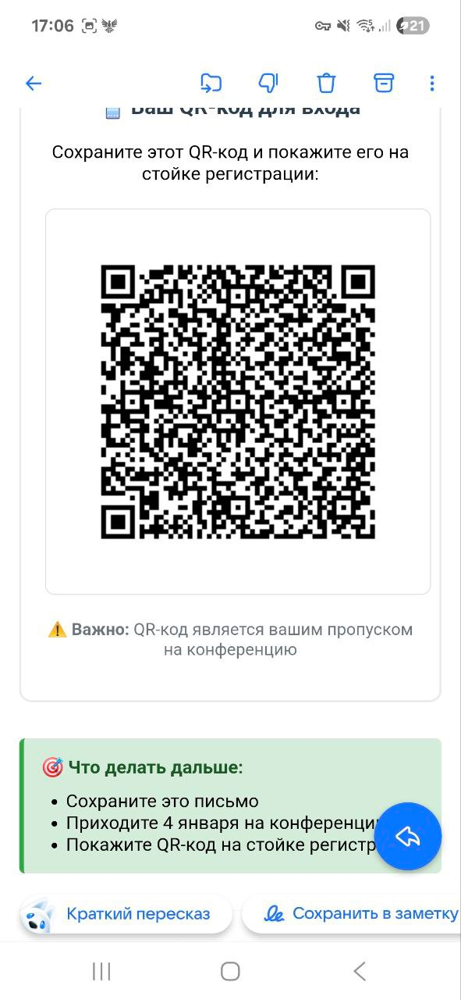

Сайт регистрации на конференцию ТИНС

Этот проект — веб-сервис для удобной и безопасной регистрации участников конференции ТИНС.
Сайт уже работает и доступен по адресу: https://wolsar.site/
Небольшое доказательство того, что он правда используется пост анонса: https://t.me/confteens/239
Ссылка на мой сайт вшита в ссылку сайта обертки на тильде в кнопке "регистрация"
Сайт был захостчен и использовался в боевом режиме с ноября до конца конференции, т.е. до середины января.

## Как всё устроено

1. Пользователь заполняет форму регистрации.
2. На почту приходит письмо о том, что регистрация получена, а для подтверждения необходимо загрузить чек перевода.
3. Участник переводит добровольное пожертвование, загружает PDF-чек на сайт.
4. Сервис проверяет валидность PDF-файла: совпадение получателя, банка и суммы. Если данные не совпадают, регистрация считается незавершенной.
5. Если всё хорошо: данные попадают в базу, дублируются в таблицу на Яндекс Диске, участнику отправляется письмо с подтверждением, вместе с ним — QR-код, содержащий всю нужную информацию для прохождения на конференции.
6. Каждые 10 минут сервис обновления Яндекс.Диска проверяет новые регистрации и обновляет таблицу. Данные кешируются в Redis для уменьшения нагрузки на базу.
7. Микросервис выгрузки данных на Яндекс.Диск формирует два листа:
   **PaidRegistrations** — все оплаченные регистрации;
   **Attempts** — все попытки регистрации, где участники получили первое письмо, но чек не был загружен.  
      Продьюсер основного бекенда создает событие о регистрации, консьюмер микросервиса обрабатывает его и обновляет таблицу.

Служители и работники офиса церкви могут просматривать регистрации через Яндекс Диск. Это позволяет удобно просматривать данные и чеки без прямого доступа к базе.

## Используемые технологии
1. Backend: Java, Spring Boot, JDBC, Kafka, Kafka-UI, Redis JavaMailSender, Thymeleaf, Flyway для миграций, написаны unit-тесты для основных сервисов
2. Бд: Postgres
3. Интеграции: API Яндекс Диска, рассылка почты.
4. Инфраструктура: Docker
5. Безопасность передачи: сервер был настроен на прием и передачу HTTPS запросов, есть сертификат от Let's Encrypt.
6. Frontend: React (TSX, scss, antd для компонент)

## Цель проекта

Автоматизировать полный цикл регистрации участников конференции.

### Проблемы и планы на будущее

- Некоторые банки (например, ВТБ) не предоставляют цифровые PDF-чеки, поэтому такие оплаты пока нельзя проверить автоматически.
- В будущем планируется использовать динамические QR-коды СБП для оплаты, но для этого требуется доступ юридического лица к интернет-эквайрингу.

## Некоторые скриншоты

